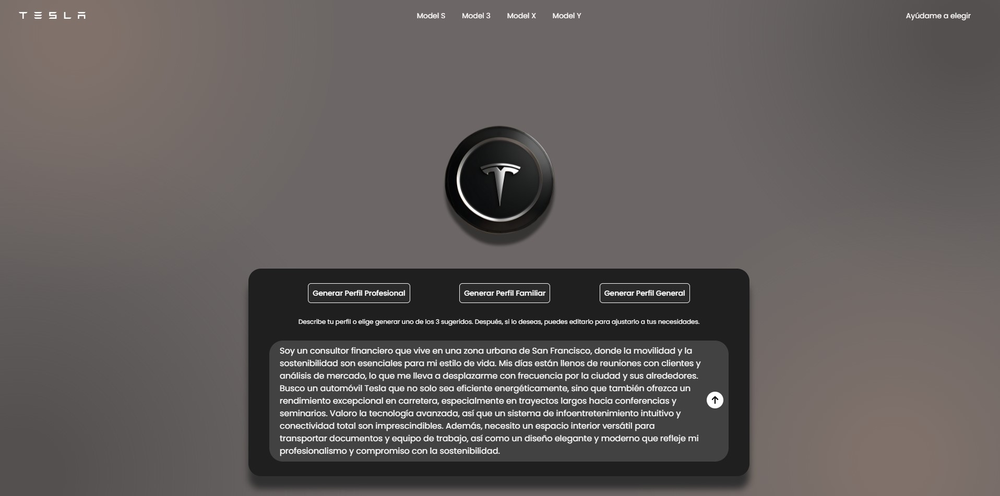

# Tesla Clone Frontend

## Descripción General

Este proyecto es el frontend de un clon de la página de Tesla, diseñado para destacar mis habilidades en desarrollo web y la integración de tecnologías avanzadas, con un enfoque particular en la **inteligencia artificial**. La aplicación permite a los usuarios interactuar con modelos de Tesla y **recibir recomendaciones personalizadas basadas en sus preferencias y necesidades específicas**, gracias a un sistema de IA integrado. Además, se implementaron transiciones fluidas entre secciones usando Framer Motion para una experiencia de usuario atractiva y dinámica.

## Capturas de Pantalla

A continuación se muestran algunas capturas de pantalla de la aplicación en funcionamiento:




## Tecnologías Utilizadas

- **React**: Framework principal para la construcción de la interfaz de usuario.
- **Redux**: Para el manejo del estado global de la aplicación.
- **Tailwind CSS**: Para el estilizado rápido y eficiente de componentes.
- **Framer Motion**: Para animaciones y efectos de transición entre páginas.
- **Inteligencia Artificial**: Implementada para analizar preferencias del usuario y recomendar el modelo de Tesla más adecuado.

## Estructura del Proyecto

La estructura del proyecto sigue un patrón típico de una aplicación creada con Create React App, con la adición de carpetas específicas para componentes, páginas, y lógica de Redux.

```
src/
│
├── assets/                # Recursos estáticos como imágenes y videos
│   ├── images/            
│   └── videos/            
│
├── components/            # Componentes reutilizables de la UI
│   ├── alert/
│   │   └── Alert.jsx
│   ├── callToActionSlide/
│   │   └── CallToActionSlide.jsx
│   ├── elementBackground/
│   │   └── ElementBackground.jsx
│   └── ...               # Otros componentes
│
├── pages/                 # Páginas principales del proyecto
│   ├── choose/
│   │   ├── Principal.jsx
│   │   ├── Profile.jsx
│   │   └── Recommendation.jsx
│   ├── home/
│   │   └── Home.jsx
│   └── models/
│       ├── Model3Page.jsx
│       └── ...            # Otros modelos
│
├── redux/                 # Lógica relacionada con Redux
│   ├── actions.js
│   ├── reducer.js
│   └── store.js
│
├── utils/                 # Utilidades varias
│   └── photoList.js
│
├── App.css                # Estilos generales
├── App.js                 # Componente raíz de la aplicación
└── index.js               # Punto de entrada de la aplicación
```

## Funcionalidades Clave

- **Interacción con Modelos de Tesla**: Los usuarios pueden explorar diferentes modelos de Tesla, cambiar el color del vehículo, y ver diferentes vistas del exterior e interior.
- **Recomendaciones Personalizadas con IA**: Utilizando inteligencia artificial, la aplicación analiza las preferencias del usuario, como estilo de vida y necesidades específicas, para recomendar el modelo de Tesla más adecuado.
- **Transiciones Suaves**: Implementadas con Framer Motion, las transiciones entre secciones son suaves y atractivas visualmente.

## Instalación

Sigue los siguientes pasos para levantar el frontend localmente en tu máquina:

1. **Clonar el Repositorio**

   ```bash
   git clone https://github.com/MarcoAlayn/tesla-landing-ia
   cd tesla-landing-ia
   ```

2. **Instalar Dependencias**

   Asegúrate de tener [Node.js](https://nodejs.org/) instalado en tu máquina. Luego, ejecuta:

   ```bash
   npm install
   ```

3. **Correr la Aplicación**

   Una vez instaladas las dependencias, puedes correr la aplicación con:

   ```bash
   npm start
   ```

   Esto abrirá la aplicación en tu navegador por defecto en `http://localhost:3000`.

---